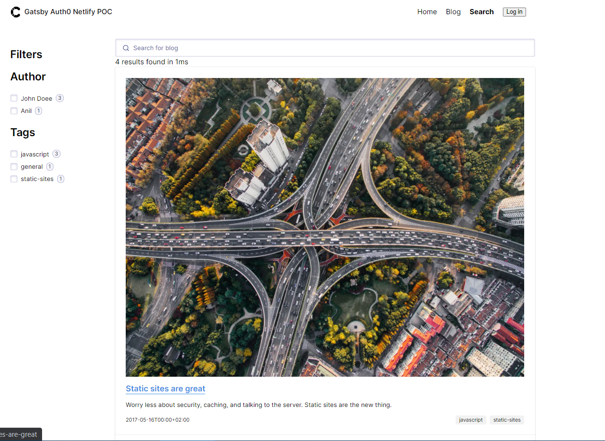

# Contentful Gatsby Starter Blog

Create a [Gatsby](http://gatsbyjs.com/) blog powered by [Contentful](https://www.contentful.com).

Static sites are scalable, secure and have very little required maintenance. They come with a drawback though. Not everybody feels good editing files, building a project and uploading it somewhere. This is where Contentful comes into play.

With Contentful and Gatsby you can connect your favorite static site generator with an API that provides an easy to use interface for people writing content and automate the publishing using services like [Travis CI](https://travis-ci.org/) or [Netlify](https://www.netlify.com/).

## Tech Stack

- Gatsby
- Contentful
- Netlify
- Gatsby Serverless function
- Auth0
- Algolia 

### Set up of the needed content model and create a configuration file

This project comes with a Contentful setup command `npm run setup`.

This command will ask you for a space ID, and access tokens for the Contentful Management and Delivery API and then import the needed content model into the space you define and write a config file (`./.contentful.json`).

`npm run setup` automates that for you but if you want to do it yourself rename `.contentful.json.sample` to `.contentful.json` and add your configuration in this file.

## Crucial Commands

### `npm run dev`

Run the project locally with live reload in development mode.

### `npm run build`

Run a production build into `./public`. The result is ready to be put on any static hosting you prefer.

### `npm run serve`

